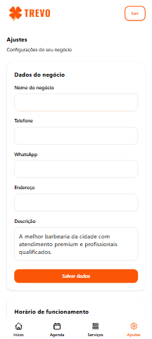

# Trevo — Sistema SaaS de Agendamento

Sistema de agendamento multi-tenant desenvolvido para atender diversos nichos como:

- Barbearias
- Clínicas
- Salões
- Prestadores de serviço

## Demonstração

🌐 Demo online  
https://trevoapp.com

## Funcionalidades

- Sistema de agendamento
- Painel administrativo
- Gestão de clientes
- Controle de horários
- Multi-tenant

## Tecnologias utilizadas

- HTML
- CSS
- JavaScript
- PHP
- MySQL

## Interface

## Observação

O código fonte completo é privado, este repositório é apenas para demonstração do projeto.
