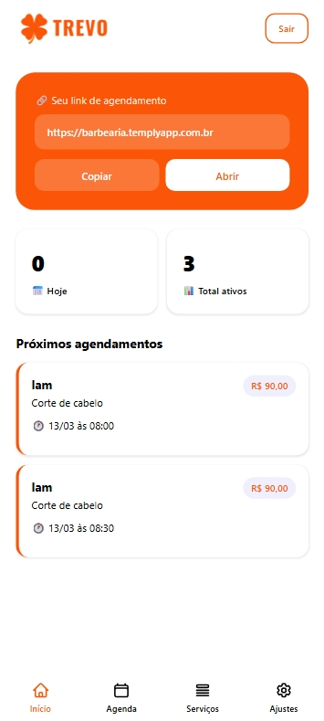

# Trevo — Sistema SaaS de Agendamento

Sistema de agendamento multi-tenant desenvolvido para atender diversos nichos como:

- Barbearias
- Clínicas
- Salões
- Prestadores de serviço

## Aviso

⚠️ O sistema ainda está em desenvolvimento.

- O **registro de novas contas** está temporariamente desativado.
- A **integração com API de pagamento** não está disponível nesta versão pública por questões de privacidade e segurança.

## Acesso para demonstração

Para testar o sistema utilize a conta de demonstração:

Email: admin@test.com  
Senha: password
## Demonstração

🌐 Demo online  
https://templyapp.com.br

🎥 Demonstração do sistema

[https://youtu.be/seuvideo](https://youtu.be/jfVHsjZxKdQ)

## Funcionalidades

- Sistema de agendamento
- Painel administrativo
- Gestão de clientes
- Controle de horários
- Multi-tenant

## Tecnologias utilizadas

- HTML
- CSS
- JavaScript
- PHP
- MySQL

## Interface

## Observação

O código fonte completo é privado, este repositório é apenas para demonstração do projeto.
